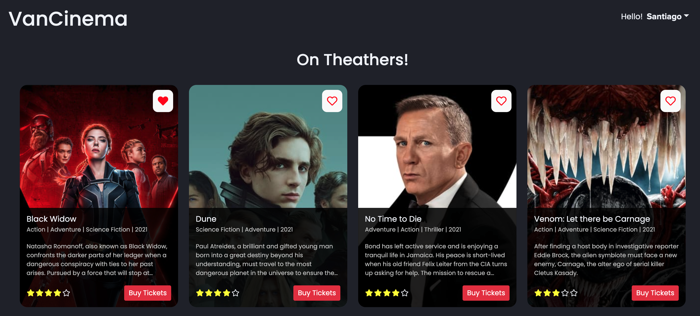

# 🎥 VanCinema - Movie Booking System



- [🎥 VanCinema - Movie Booking System](#-vancinema---movie-booking-system)
  - [Description](#description)
  - [Features](#features)
  - [Tech Stack](#tech-stack)
  - [Installation](#installation)
  - [How to use VanCinema?](#how-to-use-vancinema)
    - [Buy movie tickets](#buy-movie-tickets)
    - [Check my purchase history](#check-my-purchase-history)
    - [Check my favorite movies](#check-my-favorite-movies)
  - [API documentation](#api-documentation)
    - [Movies API Endpoints](#movies-api-endpoints)
    - [Users API Endpoints](#users-api-endpoints)

## Description

This web application is a movie ticket booking system, where the user can select a movie, check the different movie dates and times, select the seats, purchase the order, and get a confirmation message.

Overall, VanCinema provides a full experience from end-to-end to buy online tickets for the movie theather, which in this case, it is called **VanCinema**.

## Features

- **Select seats according to the date and time**
  - When the combination of the movie, date, and time is not found in the database, the movie lounge is created dinamically from the first booking. After the first booking, the seats are getting from the database, and updated per booking.
  - User can check the seats that are available, booked, and selected by him.
- **User is able to check his purchases' history**
  - In the nav menu option "My Purchases", the user can check all his purchases from the latest to the oldest one.
- **User can like or dislike any movie from the list**
  - From the home page, the user can like or dislike any movie, in order to store it in his account.
  - In the nav menu option "My Favorites", the user can check all the movies he liked from the home page. Besides, the user can dislike from this screen, and the movie will be removed automatically form the list.
- All the information about the user and the movie selected, it is being handle with **React Context API and their reducers**, in order to prevent props drilling, and manage important states just in one place.

## Tech Stack

- React.js
- React Hooks
- React Context API
- Styled-Components
- Node.js
- Express.js
- Joi (Server side data validation and sanitization)
- NoSQL Document Database: MongoDB
- Webpack

## Installation

Make sure you have Node.js installed, and be sure to have at least Node v14.8+

Clone the project, and open it with Visual Studio Code:

```bash
git clone https://github.com/jharteaga/movie-booking-system.git

cd movie-booking-system

code .
```

Now let's install all the npm dependencies:

```bash
npm install
```

Then, let's configure an environment variable to connect to a MongoDB instance, either local or cloud-based. So, let's create an _.env_ file in the root folder of the project, and let's add the following variable:

_Note: You can find MongoDB connection string in MongoDB Atlas, in case you are using a cloud-based database._

```env
DB_CONNECTION=mongodb+srv://<username>:<password>@<host>/<database-name>?retryWrites=true&w=majority
```

Before starting the web application, we need to initialize the database with some data, such as list of movies and a user. The initial data is in JSON file inside the project, and it can be found in db > data directory:

```bash
cd ./db/data
```

Let's connect to MongoDB Compass, connect to our database, and then create a collection with the name: **movies**. Then, click in the button _"ADD DATA"_, and import the json file named _"movieData.json"_


Now, let's create the last collection called _"users"_, and we are going to do the same process importing a JSON file, but in this case with the file named _"userData.json"_.

Finally, let's start the application. In order to start it we need to make sure that in the _"webpack.config.js"_ file the mode property is development, and not in production:

```javascript
module.exports = {
  mode: 'development',
  // mode: 'production',
  ...
}
```

Then, open 2 separate terminals. One will run the server, and the other one will run Webpack in order to transpile our React code into Vanilla JavasScript, and bundle it in just one file:

```bash
# Terminal 1
npm run dev
```

```bash
# Terminal 2
npm run watch
```

VanCinema web platfom should be up and running!! :rocket:

## How to use VanCinema?

### Buy movie tickets

1. In the home page, select the movie that you want to watch in the movie theather by clicking the button "Buy tickets".
2. User can check the movie details and then click in the button "Select seats"
3. Now, the user can select the date and time of the movie, and then choose the seats of preference inside the movie theather.
4. Then, the user has to introduce the payment information into the form, and click in "Purchase" when finish.
5. Finally, get purchase confirmation

<a href="https://www.loom.com/share/083b6ad247e14400ac0e008abbc5e7af">Demo</a>

### Check my purchase history

1. In the user menu that is display when click the user first name, select the menu item "My Purchases"
2. Now, the user can check all the purchases that he has made in the application.

<a href="https://www.loom.com/share/9c9b2b01d55843d1844bd25ad95fa393">Demo</a>

### Check my favorite movies

1. In the user menu that is display when click the user first name, select the menu item "My favorites"
2. User can see all the movies he has given like from the home page.
3. In order to add liked movies into the list, let's go to the home page, and click in the heart icon to add it, or to remove it in case it is already added.

<a href="https://www.loom.com/share/bf5e75121d964232859580bd5ff22d02">Demo</a>

## API documentation

The API has its version, and so far the version that is live is v1. Therefore, the base path of the API is _/api/v1_

In the server side there are 2 main endpoints:

- /movies
- /users

### Movies API Endpoints

| Route                          | HTTP method | Description                                                                     | Response Format | Query String                            |
| :----------------------------- | :---------- | :------------------------------------------------------------------------------ | :-------------- | :-------------------------------------- |
| /movies                        | GET         | Get the complete list of movies                                                 | JSON            | None                                    |
| /movies/:movieId               | GET         | Get details of a specific movie by its id                                       | JSON            | None                                    |
| /movies/:movieId/seats         | GET         | Get seats for a specific movie by date and time available in the movie theather | JSON            | ?showDate=2021-02-04&showTime=7:00%20PM |
| /movies/:movieId/seats         | POST        | Create new set of seats for a specific movie in a date and time given           | JSON            | None                                    |
| /movies/:movieId/seats/:seatId | PUT         | Update booked seats for a specific movie in a date and time given               | JSON            | None                                    |
| /movies/:movieId/purchase      | POST        | Create a new purchase for a specific movie                                      | JSON            | None                                    |

---

> /movies/:movieId/seats - POST Method

_*Body request*_

```JSON
{
  "showDate": "2021-12-04",
  "showTime": "7:00PM",
  "allSeats": [
    { "identifier": "A", "row": [0, 0, 0, 0, 0, 0, 0, 0] },
    { "identifier": "B", "row": [0, 0, 0, 0, 0, 0, 0, 0] },
    { "identifier": "C", "row": [0, 0, 0, 0, 0, 0, 0, 0] },
    { "identifier": "D", "row": [0, 0, 0, 0, 0, 0, 0, 0] },
    { "identifier": "E", "row": [0, 0, 0, 0, 0, 0, 0, 0] },
    { "identifier": "F", "row": [0, 0, 0, 0, 0, 0, 0, 0] }
  ]
}
```

> /movies/:movieId/seats - PUT Method

_*Body request*_

```JSON
{
  "seatId": "61a5c285d0bdc68044e5fff9",
  "allSeats": [
    { "identifier": "A", "row": [0, 0, 0, 0, 0, 0, 0, 0] },
    { "identifier": "B", "row": [0, 0, -1, -1, 0, 0, 0, 0] },
    { "identifier": "C", "row": [0, 0, 0, 0, 0, 0, 0, 0] },
    { "identifier": "D", "row": [0, 0, 0, 0, 0, 0, 0, 0] },
    { "identifier": "E", "row": [0, 0, 0, 0, 0, 0, 0, 0] },
    { "identifier": "F", "row": [0, 0, 0, 0, 0, 0, 0, 0] }
  ]
}
```

> /movies/:movieId/purchase - POST Method

_*Body request*_

```JSON
{
	"userId": "6190699eba679222a49e5916",
	"movie": {
		"date": "2021-11-28",
		"time": "7:00 PM",
		"seats": [
			"A1",
			"A2"
		],
		"total": 15
	},
	"payment": {
		"cardNumber": "1234567812345678",
		"cardHolder": "Santiago Salazar",
		"expirationMonth": "12",
		"expirationYear": "22",
		"cvv": "123"
	}
}
```

### Users API Endpoints

| Route                    | HTTP method | Description                                     | Response Format | Query String |
| :----------------------- | :---------- | :---------------------------------------------- | :-------------- | :----------- |
| /users                   | GET         | Get list of all users registered in VanCinema   | JSON            | None         |
| /users/:userId           | GET         | Get user details by its id                      | JSON            | None         |
| /users/:userId/like      | PUT         | Update list of liked movies for a specific user | JSON            | None         |
| /users/:userId/purchases | GET         | Get purchase history for a specific user        | JSON            | None         |

---

> /users/:userId/like - POST Method

_*Body request*_

```JSON
{
	"movieLikes": [
		"6190689fba679222a49e5910"
	]
}
```
